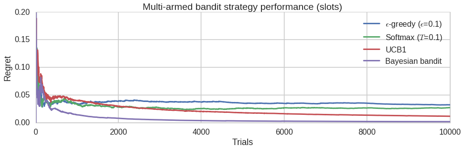

# slots

<a href="https://twitter.com/acdlite/status/974390255393505280">
  
</a>
<a href="https://github.com/ambv/black">
    
</a>
<a>
    
</a>
<a>
    
</a>


### *A multi-armed bandit library for Python*

Slots is a multi-armed bandit library for Python, applicable to real world historical testing situations. 
This project was forked from https://github.com/roycoding/slots. Thanks to Roy Keyes for the initial idea and implementation

#### Authors
[Roy Keyes](https://roycoding.github.io) -- roy.coding@gmail

[Benjamin Jiang](https://www.jiangmadethis.com) -- benjaminyjiang@gmail.com

#### License: MID
See [LICENSE.txt](https://github.com/Chryzanthemum/slots/blob/master/LICENSE.txt)


### Introduction
slots is a Python library designed to allow the user to explore and use simple multi-armed bandit (MAB) strategies. The basic concept behind the multi-armed bandit problem is that you are faced with *n* choices (e.g. slot machines, medicines, or UI/UX designs), each of which results in a "win" with some unknown probability. Multi-armed bandit strategies are designed to let you quickly determine which choice will yield the highest result over time, while reducing the number of tests (or arm pulls) needed to make this determination. Typically, MAB strategies attempt to strike a balance between "exploration", testing different arms in order to find the best, and "exploitation", using the best known choice. There are many variation of this problem, see [here](https://en.wikipedia.org/wiki/Multi-armed_bandit) for more background.

slots provides a hopefully simple API to allow you to explore, test, and use these strategies. Basic usage looks like this:

Using slots to determine the best of 3 variations on a live website.
```Python
import slots

mab = slots.MAB(3)
```

Make the first choice randomly, record responses, and input reward 2 was chosen. Run online trial (input most recent result) until test criteria is met.
```Python
mab.online_trial(bandit=2,payout=1)
```

The response of `mab.online_trial()` is a dict of the form:
```Python
{'new_trial': boolean, 'choice': int, 'best': int}
```
Where:
- If the criterion is met, `new_trial` = `False`.
- `choice` is the current choice of arm to try.
- `best` is the current best estimate of the highest payout arm.


To test strategies on arms with pre-set probabilities:

```Python
# Try 3 bandits with arbitrary win probabilities
b = slots.MAB(3, live=False)
b.run()
```

To inspect the results and compare the estimated win probabilities versus the true win probabilities:
```Python
b.best()
> 0

# Assuming payout of 1.0 for all "wins"
b.est_payouts()
> array([ 0.83888149,  0.78534031,  0.32786885])

b.bandits.probs
> [0.8020877268854065, 0.7185844454955193, 0.16348877912363646]
```

By default, slots uses the epsilon greedy strategy. Besides epsilon greedy, the softmax, upper confidence bound (UCB1), and Bayesian bandit strategies are also implemented.

#### Regret analysis
A common metric used to evaluate the relative success of a MAB strategy is "regret". This reflects that fraction of payouts (wins) that have been lost by using the sequence of pulls versus the currently best known arm. The current regret value can be calculated by calling the `mab.regret()` method.

For example, the regret curves for several different MAB strategies can be generated as follows:
```Python

import matplotlib.pyplot as plt
import seaborn as sns
import slots

# Test multiple strategies for the same bandit probabilities
probs = [0.4, 0.9, 0.8]

strategies = [{'strategy': 'eps_greedy', 'regret': [],
               'label': '$\epsilon$-greedy ($\epsilon$=0.1)'},
              {'strategy': 'softmax', 'regret': [],
               'label': 'Softmax ($T$=0.1)'},
              {'strategy': 'ucb', 'regret': [],
               'label': 'UCB1'},
              {'strategy': 'bayesian', 'regret': [],
               'label': 'Bayesian bandit'},
              ]

for s in strategies:
 s['mab'] = slots.MAB(probs=probs, live=False)

# Run trials and calculate the regret after each trial
for t in range(10000):
    for s in strategies:
        s['mab']._run(s['strategy'])
        s['regret'].append(s['mab'].regret())

# Pretty plotting
sns.set_style('whitegrid')
sns.set_context('poster')

plt.figure(figsize=(15,4))

for s in strategies:
    plt.plot(s['regret'], label=s['label'])

plt.legend()
plt.xlabel('Trials')
plt.ylabel('Regret')
plt.title('Multi-armed bandit strategy performance (slots)')
plt.ylim(0,0.2);
```


### Handling Trials in Bulk
So what happens when we want to handle a large number of trials at once? Eg, we have a ton of historical pricing data that we'd like to use. Slots provides two methods of handling series - 'hard' and 'lazy'. Hard loops 'online_trial' for you and lazy sums up the results of each arm to only add the final product. The primary advantage to using hard is that it will iterate over the entire dataframe and let you see exactly where you're getting errors. Without it, you're just going to see 'error, numpy tried to sum up your column and it didn't work, ya punk ass bitch'. 

```Python

a = [1, 1 ,2]
b = [3, 4, 1]
e=pd.DataFrame({'a':a, 'b':b}) 

s['mab'] = slots.MAB(4)

s['mab'].multiple_trials(bandits=e['a'], payouts=e['b'], method='lazy')

{'best': 1, 'choice': 1, 'new_trial': False}

```


### Non-Stationary Bandit 
One problem with the simplified MAB implementation is that it doesn't account for changing conditions. To steal an explanation from https://github.com/dquail/NonStationaryBandit: 

```If the environment was completely stationary (the slot machine didn't change it's best arm as the evening went on, solving the bandit problem at the casino would be simple. The estimate of the arm would simply be the average of the returns received from pulling that arm. This would work fantastic. But imagine, if as the clock struck midnight, suddenly the previous "best" arm became the worst because of some internal code in the slot machine. If all you were doing was calculating the average of returns, and you'd been playing all night, it would take quite some time to learn that this was no longer the best action to take. Therefore, it is often best to weight recent events more highly than past ones in a "what have you done for me lately" sense. Setting a constant step size accomplishes this. Mathematically, the step size, tells the agent how close to move it's estimate, to the new reward. If the step size is 0.1, the agent move's it's estimate 10% of the way closer to the new reward seen. If the step size is 1.0, the agent moves all the way to the new reward, essentially ignoring past behavior. Clearly this is a balance.```

We add a 'step_size' parameter where applicable. If a step size is chosen, the minimum step size is the number of payouts iterated through so far. (If you look at the math, setting step size to number of payouts iterated through is the same thing as just taking the average.) To me, it makes no sense that a sliding step size designed to move the average around quickly would contribute less of a shift than simply averaging it in the beginning. 


```Python

a = [1, 1, 2, 1, 4, 1, 1]
b = [3, 4, 1, 4, 2, 3, 3]
e=pd.DataFrame({'a':a, 'b':b}) 

s['mab'] = slots.MAB(4)
s['mab'].multiple_trials(bandits=e['a'], payouts=e['b'], method='lazy', step_size = 0.5)

{'best': 1, 'choice': 1, 'new_trial': False}

s['mab'].est_payouts(step_size = 0.5)

{3.1875, 1, 0, 2}


s['mab'].est_payouts()

{3.4, 1, 0, 2}

```
    
Honestly, this part is a little janky because you're specifying whether or not to use the step_size parameter each time instead of instantiating the MAB with a step_size. I liked the control, but you might not. 

Currently Bayesian bandit doesn't support step size because I don't fully get the math behind it yet. 
Regret seems complicated and I'm not sure how to calculate it with a non-stationary bandit.(https://arxiv.org/abs/1405.3316) Seriously, what is this garbage? I've spoken to the authors and this still doesn't make any sense. If you can do this math, hit my DM. 

### API documentation
For documentation on the slots API, see [slots-docs.md](https://github.com/Chryzanthemum/slots/blob/master/docs/slots-docs.md).


### Todo list:
- More MAB strategies
- Argument to save regret values after each trial in an array.
- TESTS!
